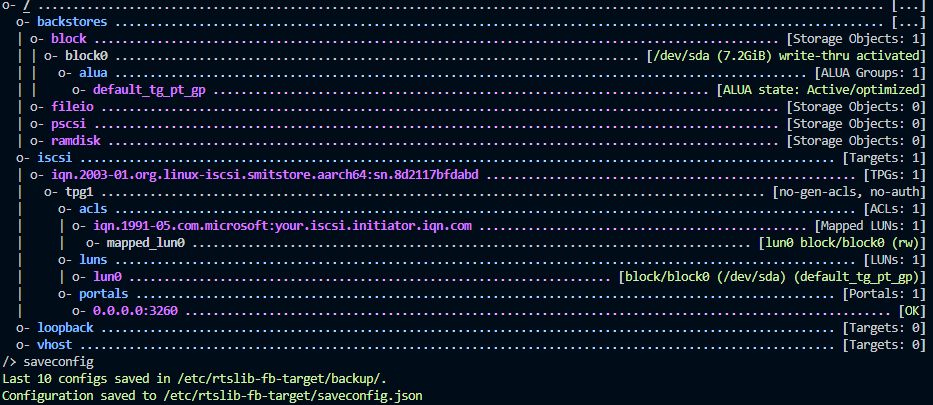

# **SmitKub**
To document and deploy an ansible backed Kubernetes cluster. 

# **ToC**
- [**SmitKub**](#smitkub)
- [**ToC**](#toc)
- [**Whats it for**](#whats-it-for)
- [**Components**](#components)
- [**Home Network Setup**](#home-network-setup)
- [**Storage**](#storage)
    - [*NFS*](#nfs)
  - [**SAN Network**](#san-network)
    - [**SAN Notes**](#san-notes)
    - [**PI POE**](#pi-poe)
- [**Ansible Setup**](#ansible-setup)
  - [**RPI Setup**](#rpi-setup)
    - [**Control system "Autobot"**](#control-system-autobot)
    - [**Worker Systems**](#worker-systems)
  - [**System maint Playbooks**](#system-maint-playbooks)
    - [**Cron job**](#cron-job)
- [**Kubernetes Installation**](#kubernetes-installation)
  - [**Node Prep**](#node-prep)
  - [**Kubernetes Cluster configuration**](#kubernetes-cluster-configuration)
    - [**Quick reference to recreating the cluster**](#quick-reference-to-recreating-the-cluster)
  - [**Configuration tools and methods**](#configuration-tools-and-methods)
    - [**Building the cluster**](#building-the-cluster)
      - [**Software packages**](#software-packages)
      - [**Bootstrapping**](#bootstrapping)
        - [**kubeadm created kubeconfig files**](#kubeadm-created-kubeconfig-files)
          - [**CA**](#ca)
          - [**Static pod manifests**](#static-pod-manifests)
      - [**Creating a control plane node**](#creating-a-control-plane-node)
      - [**Adding a node to a cluster steps**](#adding-a-node-to-a-cluster-steps)
    - [**Add node to cluster**](#add-node-to-cluster)
    - [**K9s**](#k9s)
  - [**Networking**](#networking)
    - [**Ports**](#ports)
    - [**MetalLB**](#metallb)
      - [**Prep**](#prep)
      - [**Install**](#install)
      - [**Configuration**](#configuration)
  - [**Certificate management**](#certificate-management)
    - [**NGINX Ingress**](#nginx-ingress)
      - [**Troubleshooting**](#troubleshooting)
    - [**Cert-Manager**](#cert-manager)
  - [**Operations**](#operations)
  - [**Resources**](#resources)
  - [**Output**](#output)
  - [**Kubectl**](#kubectl)
- [**Demo**](#demo)
  - [**Application deployments INTO the cluster**](#application-deployments-into-the-cluster)
    - [**Imperative configuration**](#imperative-configuration)
    - [**Declarative**](#declarative)
      - [**Generating a manifest with a dry run**](#generating-a-manifest-with-a-dry-run)
      - [**Expose application**](#expose-application)
      - [**Declarative deployment**](#declarative-deployment)
- [ScratchNotes](#scratchnotes)
- [9-26-2022](#9-26-2022)
- [successful exposure](#successful-exposure)
  - [Confirmed](#confirmed)
    - [Netplan config](#netplan-config)
  - [cleanup](#cleanup)
- [calico and external IP](#calico-and-external-ip)
  - [todo](#todo)
  - [kubernetes installation methods](#kubernetes-installation-methods)
    - [organization](#organization)
      - [Understand Ansible Roles and galaxy better.](#understand-ansible-roles-and-galaxy-better)
        - [roles](#roles)
        - [galaxy](#galaxy)
      - [manage the inventory file](#manage-the-inventory-file)
    - [manage secrets](#manage-secrets)
      - [ansible vault](#ansible-vault)
- [Victory](#victory)
- [**Resources**](#resources-1)


# **Whats it for**
The environment is used for several things. Firstly it is used in order to provide a kubernetes lab environment. Second it is used as a method of hosting some home utilities such as a Plex server, and potentially other services such as pihole. 

# **Components**
This cluster is designed around having 4 raspberry pi 4b 8gb units. One control module and 3 workers. The control module will perform triple duty as an ansible controller and GitHub/ADO runner.

# **Home Network Setup**
The nodes have DHCP reservations for the "smithsonite.home" network. Their information is as follows


| Name | Mac | Primary IP | Alternate IP |
| :---: | :---: | :---: | :---: |
| autobot | E4:5F:01:B9:98:00 |192.168.1.230 | 192.168.2.235 |
| smitkub1 | DC:A6:32:C7:00:71 | 192.168.1.232 | |
| smitkub2 | DC:A6:32:C1:69:C2 | 192.168.1.233 | |
| smitkub3 | E4:5F:01:6F:6D:33 | 192.168.1.234 | |
| SMITSTORE | D8:3A:DD:29:4D:6D | 192.168.1.250 | |

# **Storage**

SmitStore is currently offline. It was found that NFS servers could not handle the kind of disk reservations that some databases required. As such, all of the notes around NFS are for historical/archive reference. As SAN solution is being evaluated by means of an 8 port switch and an additional RPI4.

<details><summary>Archived SmitStore NFS Notes</summary>


Currently an ssd is attached directly to my SOHO router. 
i could not get any OS to mount it, until i found a blog stating needed ot use version 2 of the protocol. the connection string is as follows
```
mount.cifs -o rw,vers=2.0,credentials=/root/.smitstorecredentials //smitstore.smithsonite.home/storage /media/smitstore/
```
As this appears to be from an [11 year old post on the topic](https://stackoverflow.com/questions/6734400/what-does-cifs-mount-failed-w-return-code-22-indicate/73002054#73002054) i can only assume the samba server baked into my router is old as balls...and an updated solution should be explored at a later date.

[More on cifs config](https://linuxhint.com/mount-smb-shares-on-ubuntu/)

automount line

```
//smitstore.smithsonite.home/storage /media/smitstore cifs vers=2.0,credentials=/root/.smitstorecredentials
```

Also, it appears that kubernetes does not allow for [SMB based mounts](https://kubernetes.io/docs/concepts/storage/storage-classes/) for volumes,
in order to get around this, the same SMB share will be configured on each worker node. then they will be mounted as a local volume.

update: it seems that mounting a local volume requires a node affinity... meaning its not a good long term solution. Getting an NFS fileshare setup is going to have to happen.

### *NFS*
[resource](https://phoenixnap.com/kb/ubuntu-nfs-server#:~:text=1%20Install%20NFS%20Kernel%20Server.%20Start%20setting%20up,%E2%80%9Cy%E2%80%9D%20and%20press%20ENTER%20to%20start%20the%20installation.)

</details>

## **SAN Network**
After the failure of both using an SMB and an NFS share for labs/tests, an ISCSI solution is to be implemented. This will include a TP-Link TL-SG108PE (notes for firmware: hardware version stamped on the package is 5.6. Hardware version in the management interface is 5.0.)

The SAN will use the NIC's for all of the devices (vs wifi). The network is at 192.168.2.0/24 (this may get tuned at a later date).

### **SAN Notes**

```
sudo apt-get install linux-modules-extra-raspi
sudo apt install targetcli-fb
targetcli
cd iscsi/
create

```

https://www.reddit.com/r/raspberry_pi/comments/wmubyl/missing_iscsi_target_mod_for_targetcli_on_ubuntu/

"
Hi, I know this is a little late and you probably already fixed it but yes, I just came across this issue. I upgraded ubuntu and the kernel changed. I also installed: apt install linux-modules-extra-5.15.0-1023-raspi (kernel was previously 5.15.0-1012-raspi) when I upgraded it broke and I had to reinstall with the newer kernel version (linux-modules-extra-5.15.0-1023-raspi
"


iscsi basics
followed vid https://youtu.be/elWYb2n5dLA
target cli is the application used to create and manage iscsi targets. 
iscsiadm is the tool used to locate and mount iscsi targets.

the targetcli command is hierarchal in nature. meaning you create things in particular directories of the hierarchy to configure iscsi

for example, in the below output, a blockstore (block0) is configured under backstores/block. 
an iscsi iqn is created under iscsi, and it contains tpg1 (i think thats target provider group 1).
within that you create an acl, the acl is a simply the iqn of your CLIENT, which you will not know until you configure your clients. This must be mapped to a lun to allow access.
the lun is  the lun or volume presented to the client



iscsi example from kubernetes
https://github.com/kubernetes/examples/tree/master/volumes/iscsi

This seems to imply that we need the IQN of each node to add to the ACL of the iscsi server.. but we dont need to MOUNT the iscsi drive. that is done via the pod. 

we can mount and read from multiple servers, but only write from one.

### **PI POE**
I had been reluctant to get a POE solution setup up until this point. The requirement of reliable ISCSI storage for the cluster has made this something to investigate. I have ordered a [POE+](https://www.raspberrypi.com/products/poe-plus-hat/) hat. This has some iffy reviews from people i trust (Jeff Geerling etc), but we will see how well it works. The enclosure i am using has active cooling, and the fans may be able to be disconnected from these as i hear they are quite loud, but they are also supposedly controlled by the temperature of hte unit. 

# **Ansible Setup**
The control plane is autobot.smithsonite.home. From this system we can control the other 3. 
Ansible is installed and running under a user named "ansible". It has an SSH keypair (found under "ansible SSH" in keeper). This keypair is to be uploaded to the RPI's for the Ansible users. Installation instructions are found below. The Ansible secrets vault requires a password under the homedir under ".ansiblepass".  This is kept in plain text and is a single line entry, and is not the passwords kept in the vault, but the password TO the vault. The password can be found in the ansible keeper entry and involves long range targets.


## **RPI Setup**
The pi's are configured with ubuntu 22.04 and with my own SSH keypair with the user csmithson and the campsmit network.
Additional users will be configured as needed. The first user should be "ansible". Once this user is configured, additional configuration can be done via Ansible.

### **Control system "Autobot"**

 ```
 sudo useradd -d /home/ansible -m -s/bin/bash ansible
 sudo mkdir /home/ansible/.ssh
 # At this time, copy the id_rsa and id_rsa.pub files from keeper into the /home/ansible/.ssh directory.
 sudo chmod 600 /home/ansible/.ssh/id_rsa
 sudo chmod 644 /home/ansible/.ssh/id_rsa.pub
 sudo chown ansible:ansible /home/ansible/.ssh -R
 echo "ansible ALL=(ALL) NOPASSWD:ALL" | sudo tee /etc/sudoers.d/ansible
 sudo apt install python3-pip
 sudo su

 su ansible
 python3 -m pip install --user ansible
 ```

Once ansible is installed modify your .bashrc file with the following line
```
export PATH=/home/ansible/.local/bin:$PATH
```

The user may be assumed locally by executing
```
sudo su
su ansible
```


### **Worker Systems**

This is the minimal setup required before we can remotely execute Ansible playbooks on this systems. Ideally these wont have to be logged back into after these commands are run.

 ```
 sudo useradd -d /home/ansible -m -s/bin/bash ansible
 sudo mkdir /home/ansible/.ssh
 echo ssh-rsa AAAAB3NzaC1yc2EAAAADAQABAAACAQC+U3naODIjFl07dJ9YzYUEZx7yIITCLMRy2ijEWkrrxRZgkaq/ZfAV9KaHQoCEzDtITosXIy4yDbgk4dYJw+1tDfbB3U3VUde2SaYUD3YWHyCezHhlafKdjacXZYS9fdLq0iagPs0+Rs7ORpLaiKhH78XPG4tN6ead4dG/7roTCNG67pqD7yWUL/AYe4qVMNwGNwiBG+0+CQKH2FKkhXKhDLY1r+vizf7mkehczbaF75EJbe/FxPIUoxs8GL5CFOJIsK71KW9AHuQAXmBec1iVvk9GcV4UX26ejpkOQvWRKUjTK0uXdAF1jsKQLHKbFUhSAi51H3ZZShv5v50oQAkWEULxjZ5CYfZIpsVqOZOldcxW4kYPg+L93ArvMwNhV7kKxuL88kG5Sp24QlrJ7l2L5THT2IfmANz2uF8c7HuUTwy+10iN1x+wZpeTqVktvP9N8DokrdqT20q0VqLuo1oAZloeyCJGvEj0LLMr3paSTiNs5z7GF8+PfzqO7GhhZtoWqSn9VmNHLPoAYox8lyyi1WpCyt/bQh5iIwWoC4pWWyn57RHhyGiaLfoFBOcLvSFwgXyV6CJr8g7f2kKgowyzxteqDieVR8c9XlKJdVgvA+tJlGjQbP2+zgquazqOv+4wHwJKh1tjTzrCqHv27/lNHr2ngTXDbuHuTfFv9Y4Zrw== ansible@autobot | sudo tee /home/ansible/.ssh/authorized_keys
 sudo chmod 600 /home/ansible/.ssh/authorized_keys
 sudo chown ansible:ansible /home/ansible/.ssh -R
 echo "ansible ALL=(ALL) NOPASSWD:ALL" | sudo tee /etc/sudoers.d/ansible
 sudo apt install python3-pip -y
 ```
The user may be assumed locally by executing
```
sudo su
su ansible
```

## **System maint Playbooks**
The following playbooks were created in order to handle the following  purposes
* [picool](playbooks/picool/main.yml) - This is the fan software for the classic pi cases
  * This has a dependency of the [picool](https://galaxy.ansible.com/csmithson12345/picool) ansible role
* [updates](playbooks/updates/main.yml) - This performs apt updates and upgrades
  * This has a dependency of the [aptupdate](https://galaxy.ansible.com/csmithson12345/aptupdate) ansible role

### **Cron job**
while some cron jobs will apparently leverage another user... using crontab -e doesn't actually seem to do so... nor does it seem to obey any path or home modification.
what i was able to do was execute a command as the ansible user leveraging su. it STILL does not leverage the path that the ansible user has... so

* you need to navigate to the ansible dir for the specific playbook because you cannot pump the ansible.cfg in any other way
* you need to use the FULL path to ansible-playbook in order to invoke it

as sudo 
```
crontab -e
```

```
5 1 * * * su ansible -c "cd /home/ansible/git/SmitKub/playbooks/updates && /home/ansible/.local/bin/ansible-playbook main.yml"
```
# **Kubernetes Installation**
## **Node Prep**
An ansible role has been created to deploy a consistent kubernetes installation for both worker and control nodes. The two playbooks for installation can be found in the playbooks directory
* [kubworkerinstall](playbooks/kubworkerinstall/main.yml)
* [kubeconrolinstall](playbooks/kubecontrolinstall/main.yml)

This will install all of the required packages. As of now, this will leverage version 1.26.


## **Kubernetes Cluster configuration**

### **Quick reference to recreating the cluster**
```
kubeadm config print init-defaults | tee ClusterConfiguration.yaml
sudo  kubeadm init --config=ClusterConfiguration.yaml
mkdir -p $HOME/.kube
sudo cp -i /etc/kubernetes/admin.conf $HOME/.kube/config
sudo chown $(id -u):$(id -g) $HOME/.kube/config
#install cilium
CILIUM_CLI_VERSION=$(curl -s https://raw.githubusercontent.com/cilium/cilium-cli/main/stable.txt)
CLI_ARCH=arm64
curl -L --fail --remote-name-all https://github.com/cilium/cilium-cli/releases/download/${CILIUM_CLI_VERSION}/cilium-linux-${CLI_ARCH}.tar.gz{,.sha256sum}
sha256sum --check cilium-linux-${CLI_ARCH}.tar.gz.sha256sum
sudo tar xzvfC cilium-linux-${CLI_ARCH}.tar.gz /usr/local/bin
rm cilium-linux-${CLI_ARCH}.tar.gz{,.sha256sum}
cilium install
#install Helm
curl -fsSL -o get_helm.sh https://raw.githubusercontent.com/helm/helm/main/scripts/get-helm-3
chmod 700 get_helm.sh
./get_helm.sh


```
[ClusterConfiguration.yaml](bootstrap/ClusterConfiguration.yaml) and [calico.yaml](bootstrap/calico.yaml) can be found in the bootstrap directory.


[class link](https://app.pluralsight.com/courses/9f2f79a1-8408-4c5a-8060-e424161dc54e/table-of-contents)


## **Configuration tools and methods**
The standard control plane/cluster tool is [kubeadm](https://kubernetes.io/docs/setup/production-environment/tools/kubeadm/install-kubeadm/)

[Kubernetes](https://github.com/kubernetes/kubernetes) is maintained on github 

You can install Kubernetes in multiple ways, but just using the OS Distributions repo is the preferred method for me, and the instructor.

### **Building the cluster**
* install and configure packages
* create the cluster
* Configure Pod Networking
* Join Nodes to cluster

#### **Software packages**
* containerd
* kubelet
* kubeadm
* kubectl


#### **Bootstrapping**

```
kubeadm init
```
* This performs pre-flight checks
* creates a CA
* Generate Kubeconfig files
* Generating static pod manifests
* wait for control plane pods
* taints the control plane node - keeps pods from running on the control plane node
* generates a bootstrap token
* starts and add-on components/pods.

##### **kubeadm created kubeconfig files**

These files are used to define how to connect to the cluster and include 
* client certs
* cluster api server network location

/etc/kubernetes
* admin.conf (the admin account/certificate)
* all of the below are used to authenticate to the cluster for their specific needs
  * kubelet.cof 
  * controller-manager.conf 
  * scheduler.conf 

###### **CA**
The cluster produces a self-signed CA
it CAN be a part of an external PKI, but typically its just a part of the cluster. This secures cluster communications, authentication of users and cluster components. The files live in /etc/kubernetes/pki

###### **Static pod manifests**
Manifests describe the configuration of things (typically pods)
/etc/kubernetes/manifests
* etcd
* api server
* controller manager
* scheduler
the  kubelet watches this directory and any changes invoke actions.

#### **Creating a control plane node**

<details><summary>Archived Calico Config</summary>
NOTE: Calico information is archived, as the CNI Cilium  has been adopted.

Download a yaml manifest of our network.

```
wget https://docs.projectcalico.org/manifests/calico.yaml
```

[calico](https://docs.projectcalico.org/manifests/calico.yaml)

The above configuration is modified to update the CIDR range for our cluster. this can be found [here](bootstrap/calico.yaml) under "CALICO_IPV4POOL_CIDR"

</details>

Use kubeadm to generate a valid cluster config, modify the [cluster config](bootstrap/ClusterConfiguration.yaml) to match our needs(optional), then init the cluster.

```
kubeadm config print init-defaults | tee ClusterConfiguration.yaml
```

```
sudo  kubeadm init --config=ClusterConfiguration.yaml 
```
This will output things like the IP Address:port, Token and cert hash. This information is required to join worker nodes to the cluster.

<details><summary>kubeadmin init results</summary>

```
Your Kubernetes control-plane has initialized successfully!

To start using your cluster, you need to run the following as a regular user:

  mkdir -p $HOME/.kube
  sudo cp -i /etc/kubernetes/admin.conf $HOME/.kube/config
  sudo chown $(id -u):$(id -g) $HOME/.kube/config

Alternatively, if you are the root user, you can run:

  export KUBECONFIG=/etc/kubernetes/admin.conf

You should now deploy a pod network to the cluster.
Run "kubectl apply -f [podnetwork].yaml" with one of the options listed at:
  https://kubernetes.io/docs/concepts/cluster-administration/addons/

Then you can join any number of worker nodes by running the following on each as root:

kubeadm join 192.168.1.230:6443 --token abcdef.0123456789abcdef \
        --discovery-token-ca-cert-hash sha256:eafc5fe6462d3e29e0c13ce0df5f1d38bb8d31dcdf10b0803275289181b6f179
```

</details>


Next copy the credential file to the local users configuration to allow access.
```
mkdir -p $HOME/.kube
sudo cp - i /etc/kubernetes/admin.conf $HOME/.kube/config
sudo chown $(id -u):$(id -g) $HOME/.kube/config
```

Now that we have a cluster, we install the CNI Cilium. This is done in 2 parts.
1. Installing the Cilium CLI
2. Running Cilium Install.

```
#install cilium
CILIUM_CLI_VERSION=$(curl -s https://raw.githubusercontent.com/cilium/cilium-cli/main/stable.txt)
CLI_ARCH=arm64
curl -L --fail --remote-name-all https://github.com/cilium/cilium-cli/releases/download/${CILIUM_CLI_VERSION}/cilium-linux-${CLI_ARCH}.tar.gz{,.sha256sum}
sha256sum --check cilium-linux-${CLI_ARCH}.tar.gz.sha256sum
sudo tar xzvfC cilium-linux-${CLI_ARCH}.tar.gz /usr/local/bin
rm cilium-linux-${CLI_ARCH}.tar.gz{,.sha256sum}
cilium install
```

Cilium will be deployed on nodes as you add them automatically.


#### **Adding a node to a cluster steps**
* install packages
* kubeadm join -- network location --bootstrap token -- certhash
* download cluster information
* node submits a CSR
* CA signs the CSR automatically
* Configures kubelet.conf

```
kubeadm join (ip address : port) --token (token) --discovery-token-ca-cert-hash (hash)
```

### **Add node to cluster**
* make sure it passes the ansible playbook
* obtain token

If the token has expired, you can create a new one with the below command

```
kubeadm token create --print-join-command
```
execute the command prefixed with "sudo" on the worker nodes.

If you would like to do things the hard way, execute the below section

<details><summary>New token the hard way</summary>

```
kubeadm tokenlist

TOKEN                     TTL         EXPIRES                USAGES                   DESCRIPTION                                                EXTRA GROUPS
abcdef.0123456789abcdef   23h         2022-09-12T19:13:27Z   authentication,signing   <none>                                                     system:bootstrappers:kubeadm:default-node-token

```
This token only lasts 24 hrs.
a new one can be generated with  

```
kubeadm token  create
```

Next we need the cert hash

```
openssl x509 -pubkey -in /etc/kubernetes/pki/ca.crt | openssl rsa -pubin -outform der 2>/dev/null | openssl dgst -sha256 -hex | sed 's/^.* //'

eafc5fe6462d3e29e0c13ce0df5f1d38bb8d31dcdf10b0803275289181b6f179
```

</details>

### **K9s**
K9s is a quasi-graphical tool to mange kubernetes clusters. This is a simple bin/exe that you can add to your path, or use the package managers they list in their [installation instructions](https://k9scli.io/topics/install/). 


## **Networking**

### **Ports**

**Control plane**
| Component | Ports | Used By |
| --- | --- | --- | 
| api | 6443 | All
| etcd | 2379-2380 | API/etcd |
| Scheduler | 10251 | Self |
| Controller manager | 10252 | Self |
| Kubelet | 10250 | Control Plane |

**Worker nodes**
| Component | Ports | Used By |
| --- | --- | --- | 
| Kubelet | 10250 | Control Plane |
| NodePort | 30000-32767 | All | 


### **MetalLB**
MetalLB is a solution to allow mapping of ip addresses to services. MetalLB can do ip address sharing for services, but at this time, it is assumed that you will have a pool of IP addresses and request an ip address for your service as a part of the service config. As i am not planing on hosting more than a handful of services at any given time, this should work out!

#### **Prep**

Following their [installation page](https://raw.githubusercontent.com/metallb/metallb/v0.13.10/config/manifests/metallb-native.yaml), update your config map for kube-proxy

```
kubectl edit configmap -n kube-system kube-proxy
```
The config needs to have strict ARP: set to true

```
apiVersion: kubeproxy.config.k8s.io/v1alpha1
kind: KubeProxyConfiguration
mode: "ipvs"
ipvs:
  strictARP: true
```

#### **Install**

There are several ways to install MetalLb, we are going to use a traditional manifest.

```
kubectl apply -f https://raw.githubusercontent.com/metallb/metallb/v0.13.10/config/manifests/metallb-native.yaml
```

#### **Configuration**

This used to be done via configmaps, but that has been abandoned in support of custom resources. Installing a custom resource is apparently as simple as producing yaml document and applying it.

```
kubectl apply -f ipaddrespoolcr.yaml
```

The below configuration shows an address pool of 2 addresses 192.168.1.239 and 240. It also contains the L2Advertizement, which is one of the methods MetalLB can work. These, or their alternate configurations (BGP etc) must be present or the MetalLB nodes will effectively be idle. 
```
apiVersion: metallb.io/v1beta1
kind: IPAddressPool
metadata:
  name: default
  namespace: metallb-system
spec:
  addresses:
  - 192.168.1.239-192.168.1.240
---
apiVersion: metallb.io/v1beta1
kind: L2Advertisement
metadata:
  name: advert
  namespace: metallb-system
```


## **Certificate management**
TBD - own smithsonite.net. i assume that nginx configurations will need to be passed into containers on startup to host those certificates.

* https://cert-manager.io/docs/tutorials/acme/nginx-ingress/
* 
* https://www.thinktecture.com/en/kubernetes/ssl-certificates-with-cert-manager-in-kubernetes/

### **NGINX Ingress**

kubectl apply -f https://raw.githubusercontent.com/kubernetes/ingress-nginx/controller-v1.8.1/deploy/static/provider/baremetal/deploy.yaml

Ho boy, this is exactly what i need! 

once this is deployed (a modified version of the above web manifest can be found under [boostrap/nginx-ingress.yaml](/bootstrap/nginx-ingress.yaml)) We create ingress objects to instruct the ingress controller on how to send traffic based on domain or path to different services.
https://www.youtube.com/watch?v=72zYxSxifpM

So the ingress worked as advertized. sample files can be found under [bootstrap/ingress sample](bootstrap/ingress%20sample/). 


#### **Troubleshooting**

something is off with metallb. it will stop responding after a few min. 

https://stackoverflow.com/questions/60796696/loadbalancer-using-metallb-on-bare-metal-rpi-cluster-not-working-after-installat#:~:text=MetalLB%20layer2%20mode%20doesn%27t%20receive%20broadcast%20packets%20unless,of%20the%20file%20%40reboot%20sudo%20ifconfig%20wlan0%20promisc

https://github.com/metallb/metallb/issues/253

sudo apt install net-tools
sudo ifconfig wlan0 promisc

do this on all worker nodes

### **Cert-Manager**
https://www.bing.com/videos/search?q=that+devops+guy+kubernetes+certificates&&view=detail&mid=735F2AE4292848F3A161735F2AE4292848F3A161&&FORM=VRDGAR&ru=%2Fvideos%2Fsearch%3Fq%3Dthat%2Bdevops%2Bguy%2Bkubernetes%2Bcertificates%26FORM%3DHDRSC4

https://cert-manager.io/docs/installation/

kubectl apply -f https://github.com/cert-manager/cert-manager/releases/download/v1.12.0/cert-manager.yaml


Success
The bootstrap folder has been updated with an example application which stores the 

i should make a mermaid diagram of this (and will shortly).

* Metallb pool configured
* nginx ingress controller deployed
  * can we make it consistently get assigned the first address in the pool? perhaps it gets its own metal LB pool with only 1 ip address?
* cert manager deployed
  * cert-issuer for nginx for the "home.smithsonite.net" created
  * certificate request for home.smithsonite.net created
* ingress map for the host home.smithsonite.net was created
  * services are configured for nodeport (vs load balancer) as the nginx ingress load balancer is the only ip address needed.

next steps. 
create another ip address pool for plex. configure it and its service to have an avaliable external ip.


## **Operations**
kubectl - primary tool
* operations
  * apply/create - creates a resource
  * run - start a pod from an image (ad hoc)
  * explain - documentation for the resource
  * delete - deletes a resource
  * get - list resources
  * describe - detailed resource information
  * exec - execute a command on a container (like docker exec)
  * logs - view logs on a container - valuable troubleshooting

## **Resources**

* resources
  * nodes (no)
  * pods (po)
  * services (svc)

## **Output**
* output
  * format
    * wide - output additional info
    * yaml - YAML formatted API object
    * json - JSON formatted API object
    * dry-run - print an object without sending it to the API server (skeleton)
  

## **Kubectl**

```
kubectl [command] [type] [name] [flags]

kubectl get pods pod1 --output=yaml
kubectl create deployment nginx --image=nginx
```

To enable autocomplete, perform the following 
```
echo "source <(kubectl completion bash)" >> ~/.bashrc
source ~/.bashrc
```

# **Demo**

|NOTE!!!|
| :-: | 
|**Found that the super basic hello-world samples below do NOT support ARM processors. switched to good ole nginx.**|

## **Application deployments INTO the cluster**

### **Imperative configuration**

this is one object at a time...
```
kubectl create deployment nginx --image=nginx
```

```
kubectl run nginx --image=nginx
```

Imperative just means using the CLI to deploy things manually, CLI isn't sustainable

### **Declarative**
This has us define our desired state in code as a manifest

**Example manifest**
```
apiVersion: apps/v1
kind: Deployment
metadata:
  name: hello-world
spec:
  replicas: 1
  selector:
    matchLabels:
      app: hello-world
  template:
    metadata:
      labels:
        app: hello-world
    spec:
      containers:
        - image: gcr.io/google-samples/hello-app:1.0
          name: hello-app

```
We apply a manifest with kubectl 

```
kubectl apply -f deployment.yaml
```
#### **Generating a manifest with a dry run**
This will use the "--dry-run" feature to generate a valid manifest file for us to modify and consume!

```
kubectl create deployment hello-world --image=gcr.io/google-samples/hello-app:1.0 --dry-run=client -o yaml > deployment.yaml
```

To list out the running containers on any cluster member.

```
sudo crictl --runtime-endpoint unix:///run/containerd/containerd.sock ps
```

attaching a shell to a pod

```
kubectl exec -it hello-world-pod -- /bin/bash
```


#### **Expose application**

An application is exposed by creating a service for it. However a service does not necessarily have exposure outside of the cluster itself. For that we will tackle Ingress and LoadBalancers.

```
kubectl expose deployment nginx-6d666844f6-rrjjn --port=80 --target-port=80
```

```
ansible@autobot:~/git/SmitKub/appdeploy$ kubectl describe service nginx
Name:              nginx
Namespace:         default
Labels:            app=nginx
Annotations:       <none>
Selector:          app=nginx
Type:              ClusterIP
IP Family Policy:  SingleStack
IP Families:       IPv4
IP:                10.99.122.48
IPs:               10.99.122.48
Port:              <unset>  80/TCP
TargetPort:        80/TCP
Endpoints:         192.168.4.2:80
Session Affinity:  None
Events:            <none>
```

```
ansible@autobot:~/git/SmitKub/appdeploy$ curl http://10.99.122.48:80
<!DOCTYPE html>
<html>
<head>
<title>Welcome to nginx!</title>
<style>
html { color-scheme: light dark; }
body { width: 35em; margin: 0 auto;
font-family: Tahoma, Verdana, Arial, sans-serif; }
</style>
</head>
<body>
<h1>Welcome to nginx!</h1>
<p>If you see this page, the nginx web server is successfully installed and
working. Further configuration is required.</p>

<p>For online documentation and support please refer to
<a href="http://nginx.org/">nginx.org</a>.<br/>
Commercial support is available at
<a href="http://nginx.com/">nginx.com</a>.</p>

<p><em>Thank you for using nginx.</em></p>
</body>
</html>
```


#### **Declarative deployment**
application
```
kubectl create deployment nginx --image=nginx --dry-run=client -o yaml | more
```

service

```
kubectl expose deployment nginx --port=80 --target-port=80 --dry-run=client -o yaml > service.yaml
```

```
kubectl apply -f service.yaml
```

to update an  application,  update the manifest and then re-apply with kubectl

```
kubectl apply -f deployment.yaml
```

<details><summary>Ad-hoc notes</summary>

# ScratchNotes
# 9-26-2022
picking up
navigated to /git/SmitKube/appdeploy/hello-world

had to 
```
kubectl create deployment nginx --image=nginx

kubectl expose deployment nginx --port=80 --target-port=80 --dry-run=client -o yaml > service.yaml

kubectl apply -f service.yaml
```

how do we expose the app on the routable network.
```
kubectl expose deployment nginx --port=80 --target-port=80 --type=NodePort --dry-run=client -o yaml > service.yaml
```
# successful exposure
Per this [helpful article](https://medium.com/swlh/kubernetes-external-ip-service-type-5e5e9ad62fcd) The app is successfully exposed by leveraging the control node's ip address in the configuration. I suspect that if i configure a service such as keepalived on multiple control nodes, the issue of "HA" would be resolved.
in the meantime i am going to try and provision some specific IP addresses on the control node and see if i can get nginx to follow it.

```
ansible@autobot:~/git/SmitKub/appdeploy/hello-world$ cat service.yaml 
apiVersion: v1
kind: Service
metadata:
  creationTimestamp: null
  labels:
    app: nginx
  name: nginx
spec:
  ports:
  - port: 80
    protocol: TCP
    targetPort: 80
  selector:
    app: nginx
  externalIPs:
    - 192.168.1.230
status:
  loadBalancer: {}
```

```
Current DNS Server: 192.168.1.231
       DNS Servers: 192.168.1.231 192.168.1.1
        DNS Domain: smithsonite.home
```

## Confirmed
Confirmed working when a specific ip address (192.168.1.235) was assigned to the control node

### Netplan config

```
ansible@autobot:~/git/SmitKub/appdeploy/hello-world$ cat /etc/netplan/50-cloud-init.yaml
# This file is generated from information provided by the datasource.  Changes
# to it will not persist across an instance reboot.  To disable cloud-init's
# network configuration capabilities, write a file
# /etc/cloud/cloud.cfg.d/99-disable-network-config.cfg with the following:
# network: {config: disabled}
network:
    version: 2
    wifis:
        renderer: networkd
        wlan0:
            access-points:
                CampSmit:
                    hidden: true
                    password: this is a secret...
            dhcp4: no
            addresses: [192.168.1.230/24, 192.168.1.235/24]
            routes:
                - to: default
                  via: 192.168.1.1
            nameservers:
              addresses: [192.168.1.231, 192.168.1.1]
              search: [smithsonite.home]
            optional: true
```
then use

```
sudo netplan apply
```

## cleanup
```
kubectl delete service nginx
kubectl delete deployment nginx
```


# calico and external IP
https://projectcalico.docs.tigera.io/networking/advertise-service-ips

ok.. so nodeport will require a unique ip/port combination for all services...

INGRESS will allow us to use a reverse proxy.. such as NGINX.
Ingress looks like what i want to setup

it LOOKS like ingress services just get a public ip.

so ingress deployment > service > application deployment.


## todo
Settle on a method to schedule jobs ( a cronjob direct on autobot, or a github-actions based schedule)

## kubernetes installation methods


* [kubeadm](https://kubernetes.io/docs/setup/production-environment/tools/kubeadm/install-kubeadm/)
* [kubespray](https://kubernetes.io/docs/setup/production-environment/tools/kubespray/)
* [kubespray/equinix metal](https://kubespray.io/#/docs/equinix-metal)
  
  leaning towards kubeadm as its the "supported" release.


### organization
In the same way i handled the primary pipeline and child pipelines... you can use the import_tasks to bring it other files containing tasks.


#### Understand Ansible Roles and galaxy better.
##### roles
make a roles folder
make a folder named for the role
2 things are required
a meta directory
a tasks folder

roles are automatically picked up from the global roles folder /etc/ansible/roles.
they are also automatically picked up if there is a roles folder in  the DIR your executing from
you can also configure the ansible.cfg file to point to a roles dir.

typically good practice to make an ansible.cfg file in your project directory
inside of that you will want to specify a roles path *(usually ./roles)
that way conflicting versions of a role will not overwrite each other.


##### galaxy
The ansible-galaxy role init  will create a "scaffold" of a proper role
```
ansible-galaxy role init test
```


#### manage the inventory file

### manage secrets
#### ansible vault
ansible vault allows you to encrypt files and store them in source control
i am not a fan  of that.
it also seems to need a password to access it. 

hold back a specific apt package with apt hold
https://docs.ansible.com/ansible/latest/collections/ansible/builtin/dpkg_selections_module.html

find available versions
```
apt-cache showpkg <package-name>
```
install a specific version
```
sudo apt install package=version -V
```
sudo apt install vault=1.11.2-1 -V


this seems to work with the sample playbook below. running additional apt updates and upgrades did not upgrade vault.
```
---
- name: apt lock testing
  hosts:
  - smitkub1.smithsonite.home
  become: true

  tasks:
  - name: Run the equivalent of "apt-get update" as a separate step
    ansible.builtin.apt:
      update_cache: yes

  - name: install hashicorp vault
    ansible.builtin.apt:
      name: vault=1.11.2-1
      state: present

  - name: Prevent vault from being upgraded
    ansible.builtin.dpkg_selections:
      name: vault
      selection: hold
```

Currently on pre-flight

https://kubernetes.io/docs/tasks/administer-cluster/kubeadm/configure-cgroup-driver/

```
[init] Using Kubernetes version: v1.24.0
[preflight] Running pre-flight checks
        [WARNING SystemVerification]: missing optional cgroups: blkio
error execution phase preflight: [preflight] Some fatal errors occurred:
        [ERROR CRI]: container runtime is not running: output: time="2022-09-07T21:18:17-04:00" level=fatal msg="unable to determine runtime API version: rpc error: code = Unavailable desc = connection error: desc = \"transport: Error while dialing dial unix /var/run/containerd/containerd.sock: connect: no such file or directory\""
, error: exit status 1
        [ERROR FileContent--proc-sys-net-bridge-bridge-nf-call-iptables]: /proc/sys/net/bridge/bridge-nf-call-iptables does not exist
        [ERROR FileContent--proc-sys-net-ipv4-ip_forward]: /proc/sys/net/ipv4/ip_forward contents are not set to 1
        [ERROR KubeletVersion]: the kubelet version is higher than the control plane version. This is not a supported version skew and may lead to a malfunctional cluster. Kubelet version: "1.25.0" Control plane version: "1.24.0"
[preflight] If you know what you are doing, you can make a check non-fatal with `--ignore-preflight-errors=...`
To see the stack trace of this error execute with --v=5 or higher
```


kubelet versions 
* 1.25.0-00
* 1.24.4-00
* 1.24.3-00
* 1.24.2-00

kubectl version
* 1.25.0-00
* 1.24.4-00
* 1.24.3-00
* 1.24.2-00

kubeadm version
* 1.25.0


ended the day here
https://kubernetes.io/docs/setup/production-environment/container-runtimes/#containerd-systemd

resource?
https://computingforgeeks.com/install-kubernetes-cluster-ubuntu-jammy/

# Victory

```
ansible@autobot:~$ sudo kubeadm init --config kubeadm-config.yaml
[init] Using Kubernetes version: v1.25.0
[preflight] Running pre-flight checks
        [WARNING SystemVerification]: missing optional cgroups: blkio
[preflight] Pulling images required for setting up a Kubernetes cluster
[preflight] This might take a minute or two, depending on the speed of your internet connection
[preflight] You can also perform this action in beforehand using 'kubeadm config images pull'
[certs] Using certificateDir folder "/etc/kubernetes/pki"
[certs] Generating "ca" certificate and key
[certs] Generating "apiserver" certificate and key
[certs] apiserver serving cert is signed for DNS names [autobot kubernetes kubernetes.default kubernetes.default.svc kubernetes.default.svc.cluster.local] and IPs [10.96.0.1 192.168.1.230]
[certs] Generating "apiserver-kubelet-client" certificate and key
[certs] Generating "front-proxy-ca" certificate and key
[certs] Generating "front-proxy-client" certificate and key
[certs] Generating "etcd/ca" certificate and key
[certs] Generating "etcd/server" certificate and key
[certs] etcd/server serving cert is signed for DNS names [autobot localhost] and IPs [192.168.1.230 127.0.0.1 ::1]
[certs] Generating "etcd/peer" certificate and key
[certs] etcd/peer serving cert is signed for DNS names [autobot localhost] and IPs [192.168.1.230 127.0.0.1 ::1]
[certs] Generating "etcd/healthcheck-client" certificate and key
[certs] Generating "apiserver-etcd-client" certificate and key
[certs] Generating "sa" key and public key
[kubeconfig] Using kubeconfig folder "/etc/kubernetes"
[kubeconfig] Writing "admin.conf" kubeconfig file
[kubeconfig] Writing "kubelet.conf" kubeconfig file
[kubeconfig] Writing "controller-manager.conf" kubeconfig file
[kubeconfig] Writing "scheduler.conf" kubeconfig file
[kubelet-start] Writing kubelet environment file with flags to file "/var/lib/kubelet/kubeadm-flags.env"
[kubelet-start] Writing kubelet configuration to file "/var/lib/kubelet/config.yaml"
[kubelet-start] Starting the kubelet
[control-plane] Using manifest folder "/etc/kubernetes/manifests"
[control-plane] Creating static Pod manifest for "kube-apiserver"
[control-plane] Creating static Pod manifest for "kube-controller-manager"
[control-plane] Creating static Pod manifest for "kube-scheduler"
[etcd] Creating static Pod manifest for local etcd in "/etc/kubernetes/manifests"
[wait-control-plane] Waiting for the kubelet to boot up the control plane as static Pods from directory "/etc/kubernetes/manifests". This can take up to 4m0s
[kubelet-check] Initial timeout of 40s passed.
[apiclient] All control plane components are healthy after 46.506945 seconds
[upload-config] Storing the configuration used in ConfigMap "kubeadm-config" in the "kube-system" Namespace
[kubelet] Creating a ConfigMap "kubelet-config" in namespace kube-system with the configuration for the kubelets in the cluster
[upload-certs] Skipping phase. Please see --upload-certs
[mark-control-plane] Marking the node autobot as control-plane by adding the labels: [node-role.kubernetes.io/control-plane node.kubernetes.io/exclude-from-external-load-balancers]    
[mark-control-plane] Marking the node autobot as control-plane by adding the taints [node-role.kubernetes.io/control-plane:NoSchedule]
[bootstrap-token] Using token: tyyxjh.6p6046i6os50ovbz
[bootstrap-token] Configuring bootstrap tokens, cluster-info ConfigMap, RBAC Roles
[bootstrap-token] Configured RBAC rules to allow Node Bootstrap tokens to get nodes
[bootstrap-token] Configured RBAC rules to allow Node Bootstrap tokens to post CSRs in order for nodes to get long term certificate credentials
[bootstrap-token] Configured RBAC rules to allow the csrapprover controller automatically approve CSRs from a Node Bootstrap Token
[bootstrap-token] Configured RBAC rules to allow certificate rotation for all node client certificates in the cluster
[bootstrap-token] Creating the "cluster-info" ConfigMap in the "kube-public" namespace
[kubelet-finalize] Updating "/etc/kubernetes/kubelet.conf" to point to a rotatable kubelet client certificate and key
[addons] Applied essential addon: CoreDNS
[addons] Applied essential addon: kube-proxy

Your Kubernetes control-plane has initialized successfully!

To start using your cluster, you need to run the following as a regular user:

  mkdir -p $HOME/.kube
  sudo cp -i /etc/kubernetes/admin.conf $HOME/.kube/config
  sudo chown $(id -u):$(id -g) $HOME/.kube/config

Alternatively, if you are the root user, you can run:

  export KUBECONFIG=/etc/kubernetes/admin.conf

You should now deploy a pod network to the cluster.
Run "kubectl apply -f [podnetwork].yaml" with one of the options listed at:
  https://kubernetes.io/docs/concepts/cluster-administration/addons/

Then you can join any number of worker nodes by running the following on each as root:

kubeadm join 192.168.1.230:6443 --token tyyxjh.6p6046i6os50ovbz \
        --discovery-token-ca-cert-hash sha256:aaf0b576c83cc2f4d6714cf400671a50a308e91633f26445fe94c8b96fe9deea
```


much of the configuration can be found in /etc/kubernetes/ now.
The kubeadm init command and its config are my concern now. There are commands one passes in to set specific configs such as the cidr range etc. id like all of that in a config file... as is shown when configuring the [cgroup driver](https://kubernetes.io/docs/tasks/administer-cluster/kubeadm/configure-cgroup-driver/). id like to see where those can go into the specified config file.

modifying the pod cidr 
https://tufora.com/tutorials/kubernetes/change-kubernetes-pods-cidr

install flannel
```
kubectl apply -f kube-flannel.yml
```

Going to look into a kubernetes class on Puralsight now.

</details>

# **Resources**
https://app.pluralsight.com/library/courses/kubernetes-installation-configuration-fundamentals/table-of-contents

https://app.pluralsight.com/library/courses/configuring-managing-kubernetes-networking-services-ingress/table-of-contents